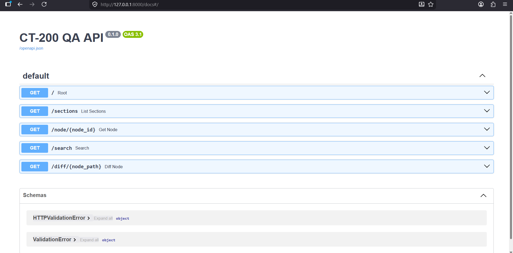
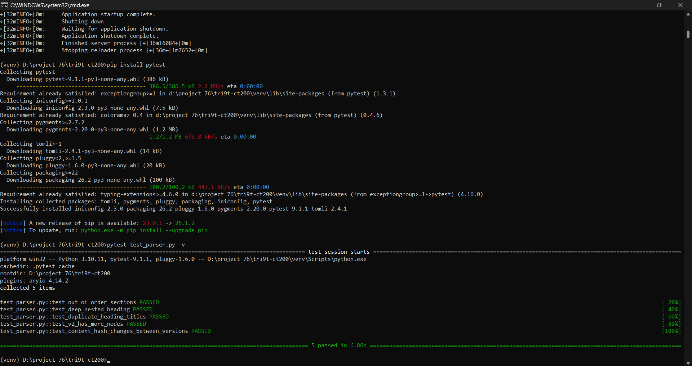

# 🩺 CT-200 QA API

> An AI-powered backend system that parses the CardioTrack CT-200 medical device manual, structures it as a versioned document tree, and generates QA test cases using LLM — with built-in staleness detection when the document changes.

---

## 📋 Table of Contents

- [Overview](#overview)
- [Architecture](#architecture)
- [Setup](#setup)
- [Running the API](#running-the-api)
- [API Reference](#api-reference)
- [Versioning Flow](#versioning-flow)
- [Running Tests](#running-tests)
- [Design Decisions](#design-decisions)

---

## 🔍 Overview

The CT-200 QA API solves a real problem in regulated software development: keeping QA test cases in sync with a changing technical document. It:

- Parses a medical device PDF into a structured, versioned hierarchy
- Detects structural quirks in the document (out-of-order sections, deeply nested headings, duplicate titles)
- Generates QA test cases from selected sections using Groq LLM
- Flags previously generated test cases as **stale** when their source text changes

---

## 🏗️ Architecture

<pre>
tri9t-ct200/
│
├── app/
│   ├── main.py           # FastAPI routes
│   ├── models.py         # SQLAlchemy models
│   ├── database.py       # DB connection + init
│   ├── parser.py         # PDF parsing + tree building
│   ├── ingest.py         # Document ingestion logic
│   └── llm.py            # Groq LLM integration
│
├── data/
│   ├── ct200_manual.pdf       # V1 document
│   └── ct200_manual_v2.pdf    # V2 document
│
├── ingest_run.py         # Run to ingest both versions
├── test_parser.py        # Unit tests
├── generations.json      # LLM output store (JSON)
├── .gitignore
└── README.md
</pre>

## ⚙️ Tech Stack

| Layer | Technology |
|---|---|
| API Framework | FastAPI |
| Database | SQLite + SQLAlchemy |
| LLM Output Store | JSON file store |
| PDF Parsing | pdfplumber |
| LLM Provider | Groq (llama-3.1-8b-instant) |
| Testing | pytest |

---
## 📸 Screenshots

### API Overview


### Homepage


### All Tests Passing


### Post Selections


### Running Application


### Project Structure in VS Code


## ⚙️ Setup

### Prerequisites
- Python 3.10+
- A free [Groq API key](https://console.groq.com)

### Installation

```bash
# Clone the repository
git clone https://github.com/Hackcode18/tri9t-ct200.git
cd tri9t-ct200

# Create and activate virtual environment
python -m venv venv
venv\Scripts\activate        # Windows
source venv/bin/activate     # Mac/Linux

# Install dependencies
pip install fastapi uvicorn sqlalchemy pdfplumber python-dotenv requests pytest
```

### Environment Variables

Create a `.env` file in the root directory:

```env
GROQ_API_KEY=your_groq_api_key_here
DATABASE_URL=sqlite:///./ct200.db
```

---

## 🚀 Running the API

### Step 1 — Ingest both document versions

```bash
python ingest_run.py
```

Expected output:
Ingesting V1...
Ingested version 1 with 32 nodes.
Ingesting V2...
Ingested version 2 with 33 nodes.
### Step 2 — Start the API server

```bash
uvicorn app.main:app --reload
```

Visit **http://127.0.0.1:8000/docs** for the interactive API documentation.

---

## 📡 API Reference

### Browse

| Method | Endpoint | Description |
|---|---|---|
| GET | `/sections?version=1` | List top-level sections (default: latest version) |
| GET | `/node/{id}` | Get a node by ID with children and hash |
| GET | `/search?q=overpressure` | Search nodes by heading or body text |
| GET | `/diff/{node_path}` | Compare a node across versions |

### Selections

| Method | Endpoint | Description |
|---|---|---|
| POST | `/selections` | Create a version-pinned selection of nodes |
| GET | `/selections/{id}` | Retrieve a selection and its pinned nodes |

### Generation & Retrieval

| Method | Endpoint | Description |
|---|---|---|
| POST | `/generate` | Generate QA test cases from a selection |
| GET | `/generations/{selection_id}` | Retrieve test cases with staleness status |

---

## 🔄 Versioning Flow (V1 → V2)

This demonstrates the full versioning + staleness flow:

```bash
# 1. Ingest both versions
python ingest_run.py

# 2. Check what changed between versions
GET /diff/2.1.1.1      # Battery life: 300 cycles → 250 cycles
GET /diff/3.2          # Inflation increment: 40mmHg → 30mmHg

# 3. Create a selection from V1 nodes
POST /selections
{
  "name": "battery-test",
  "node_ids": [5, 6]
}

# 4. Generate test cases
POST /generate
{
  "selection_id": 1
}

# 5. Retrieve test cases — staleness is automatically checked
GET /generations/1
```

### Key Changes Between V1 and V2

| Section | V1 | V2 |
|---|---|---|
| Battery life (2.1.1.1) | 300 cycles, 15% threshold | 250 cycles, 10% threshold |
| Cuff inflation (3.2) | 40 mmHg increments | 30 mmHg increments |
| E3 deflation time (4.2) | 2 seconds | 1.5 seconds |
| Error codes | E1–E5 | E1–E6 (new E6 added) |
| Data Export (5.3) | Not present | New section added |

---

## 🧪 Running Tests

```bash
pytest test_parser.py -v
```

Expected output:
test_parser.py::test_out_of_order_sections PASSED
test_parser.py::test_deep_nested_heading PASSED
test_parser.py::test_duplicate_heading_titles PASSED
test_parser.py::test_v2_has_more_nodes PASSED
test_parser.py::test_content_hash_changes_between_versions PASSED
### What the tests cover
- **Out-of-order sections** — Section 3.4 appears before 3.3 in the PDF
- **Deep nesting** — Section 2.1.1.1 is 4 levels deep with no 2.1.1 parent
- **Duplicate headings** — "Error Codes" appears as both 4.2 and 7.1
- **Version diff** — V2 has more nodes than V1
- **Hash changes** — Content hash differs when text changes between versions

---

## 💡 Design Decisions

### Why JSON store instead of MongoDB?
The assignment permits "a well-justified JSON store." Since LLM outputs are append-only and queried by selection ID, a JSON file is sufficient for this scope. In production, MongoDB or PostgreSQL JSONB would be appropriate.

### Staleness Detection
Staleness is detected by comparing the `content_hash` (MD5) of the node text at generation time vs. the current version. This is a binary check — any change triggers a stale flag, regardless of significance. A one-word change gets the same flag as a critical threshold change. This is a known limitation documented in the approach document.

### Version Matching Strategy
Nodes are matched across versions using their **path** (e.g., `2.1.1.1`). This works well when section numbers are stable but breaks if a section is renumbered. A renamed section would be treated as a new node, orphaning old test cases.

### Duplicate Submission Policy
If the same selection name is submitted twice to `/selections`, the existing selection is returned without creating a duplicate. For `/generate`, each call creates a new generation record — allowing regeneration if needed.

---

## 📄 License

MIT
